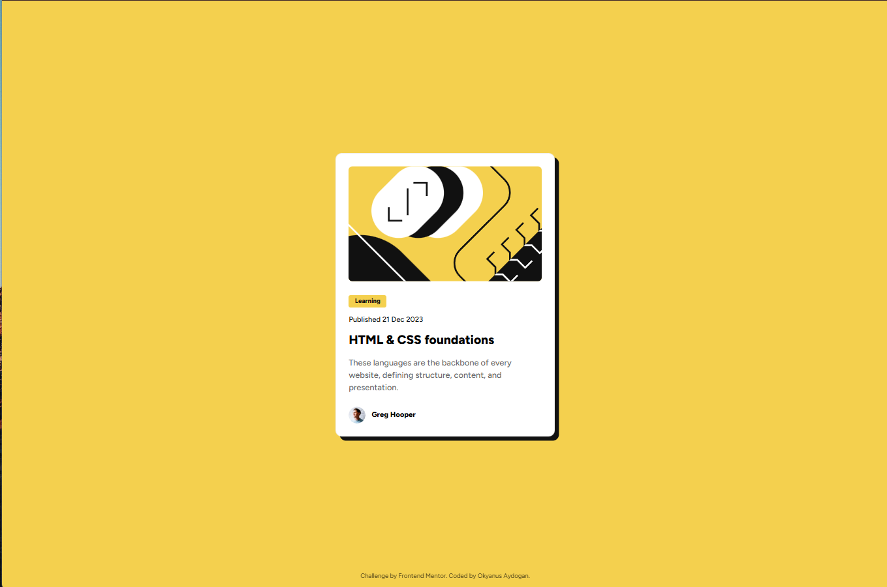

# Frontend Mentor – Blog preview card

Pixel-close implementation of the **Blog preview card** using **semantic HTML** and **Tailwind CSS (CLI, v4)**. Mobile-first, accessible focus states, and the offset shadow from the design.

## Overview
Users can:
- See **hover** and **focus** states on interactive elements
- View a clean, centered card layout on any screen size

## Screenshot


## Links
- **Solution:** https://www.frontendmentor.io/solutions/REPLACE  
- **Live:** [](https://comfy-mandazi-66d166.netlify.app)

## Built with
- Semantic **HTML5**
- **Tailwind CSS v4 (CLI)**
- **Mobile-first** workflow
- **Flexbox** centering

## What I learned (highlights)
Tailwind v4 tokens via `@theme` and using them with CSS vars:
```css
/* src/styles/input.css */
@theme {
  --color-yellow: hsl(47 88% 63%);
  --color-gray-950: hsl(0 0% 7%);
  --color-gray-500: hsl(0 0% 42%);
  --font-sans: "Figtree", sans-serif;
}
```

## What I learned (highlights)
```
project/
├─ index.html
├─ src/styles/input.css
├─ dist/styles.css        # generated (gitignored, dev)
├─ publish/               # manual deploy output (gitignored)
└─ assets/images/
```
