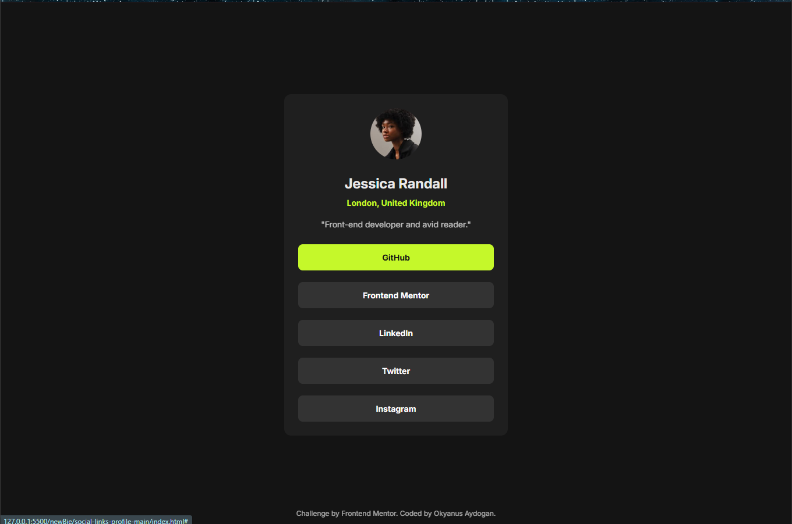

# Frontend Mentor – Social links profile

Pixel-close implementation of the **Social links profile** using **semantic HTML** and **Tailwind CSS v4 (CLI)**.  
Mobile-first layout, smooth hover/press states, and accessible focus outlines.

## Overview

**Users can:**
- See hover, focus and press feedback on the buttons
- View a clean, centered profile card on all screen sizes

## Screenshot



## Links
[](https://www.frontendmentor.io/solutions/social-links-profile-page-using-html-and-css-responsive-design-X8ta5uE28r)  
[](https://astounding-lolly-1931cf.netlify.app/)


## Built with

- Semantic **HTML5**
- **Tailwind CSS v4 (CLI)**
- **Mobile-first** workflow
- **Flexbox** centering

## Design tokens (Tailwind v4 `@theme`)

```css
@theme {
  --font-sans: "Inter", ui-sans-serif, system-ui, -apple-system, "Segoe UI",
    Roboto, Arial, "Apple Color Emoji", "Segoe UI Emoji";

  --color-qgreen: hsl(75, 94%, 57%);
  --color-qwhite: hsl(0, 0%, 100%);
  --color-qgrey-700: hsl(0, 0%, 20%);
  --color-qgrey-800: hsl(0, 0%, 12%);
  --color-qgrey-900: hsl(0, 0%, 8%);

  --radius-card: 0.75rem; /* 12px */
  --radius-pill: 0.5rem;  /* 8px */
}

@utility text-preset-1      { @apply text-[1.5rem]   leading-[1.5] font-bold; }   /* 24px */
@utility text-preset-2      { @apply text-[0.875rem] leading-[1.5] font-normal; } /* 14px */
@utility text-preset-2-bold { @apply text-[0.875rem] leading-[1.5] font-bold; }   /* 14px bold */
```
```css
project/
├─ index.html
├─ src/
│  └─ input.css          # Tailwind source (tokens, utilities)
├─ public/
│  └─ styles.css         # built CSS (output)
└─ assets/
   └─ avatar-jessica.jpeg
